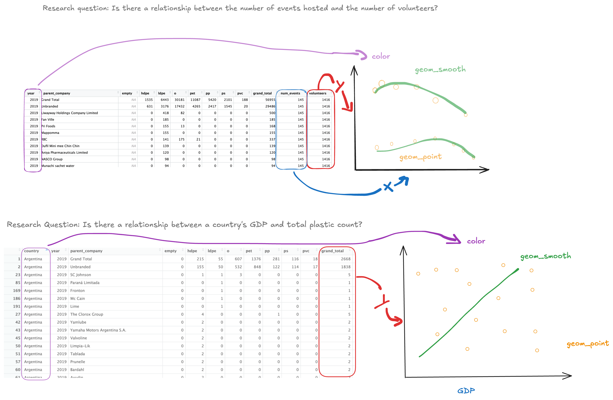

**Context of Data**

The data is from Break Free from Plastic's Brand Audits (2019 and 2020). Break Free from Plastic is a global movement to achieve a future free from plastic pollution. Their vision is for air we breathe, water we drink, and th food we eat is free of toxic by-products of plastic pollution. There are more than 13,000 organizations and individuals around the world that have come together to advocate solutions to the plastic pollution crisis. The tidytuesday data was put together by Sarah Sauve.

**Cleaning data**

To parse values as they are read in, col_double() and col_character() were used. parse_number to Grand_total dropped any non-numeric characters. Grand_total had to be read in as a character because there were commas.

To clean the data set column names to be easier to work with in R, janitor::clean_names() is used.

A year column is added after the country column (2019 and 2020) before they are combined.

Parent_company, num_events, and volunteers were renamed.

Duplicate columns, pp_2 and ps_2 were dropped.

The two years of the data sets (2019 and 2020) were stacked on top of each other using bind_rows(), combining the two data frames to a single data set.

**At Least two research questions that could be addressed with this data:**

1.  Which parent company was responsible for the most plastic waste globally, and were there significant differences in 2019 vs 2020?
2.  Which plastic type is most commonly found globally (HDPE, IDPE, PET, etc.)?
3.  What plastic type had the most increase from 2019 to 2020?
4.  Which top 5 parent companies had the highest recyclable type?
5.  Is there a relationship between the number of events hosted and the number of volunteers?

**At Least two research questions that could be addressed using supplemental data:**

1.  Is there a relationship between a country's GDP and total plastic count?
2.  What source of plastic (land-based, sea-based, fiber pollution) was the most common, and how can that be reduced?

**Visualizations Sketches:**

\

\*\*note: For the second sketch, there is no GDP column included because it is from external data that I will be doing more research on, so I just labeled it "GDP" for now.
